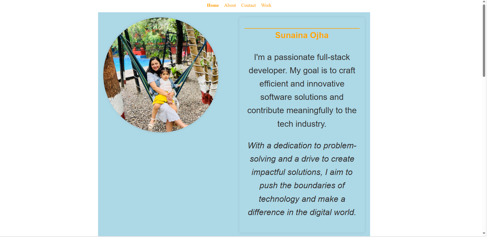
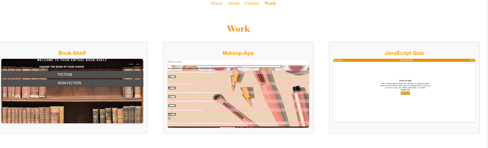

# Developer Portfolio SPA (Single-Page Application)

This SPA serves as a portfolio for showcasing a web developer's work samples, built using React.

## Overview

The portfolio allows visitors to explore the developer's projects, bio, contact information, and resume in an interactive manner.

### Key Features

- **Header:** Displays the developer's name and navigation to different sections.
- **Navigation Titles:** About Me, Work, Contact,  highlighting the current section.
- **Dynamic Sections:** Displayed based on the selected navigation title.
- **Default Selection:** Loads with the About Me section selected by default.
- **Home Section:** Includes a recent photo/avatar and a brief bio of the developer.
- **Contact Section:** Provides a medium of contact
- **Work section:** It includes the project/work i recently did.

## Installation

1. Clone the repository: `git clone <repository-url>`
2. Install dependencies: `npm install`
3. Run the application: `npm start`

## Usage

- Click on navigation titles to explore different sections.
- Review the developer's projects, bio, contact information.

## Technologies Used

- React
- HTML/CSS
- JavaScript

## Links 
[Github](https://github.com/sunainaojha/React-Portfolio)

[live UrL]()

## Screenshots

